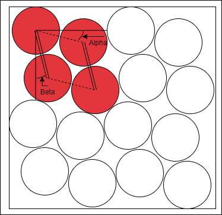

## Circle Punch  
This project is a small "optimization" problem. The purpose is to punch holes in a card leaving as little waste as possible.  
https://pbscoots.github.io/circlepunch/  
The current implementation is a greedy approach that uses some algebraic properties. The interesting stuff is in src/worker.js  

The Geometric Sweep option performs an exhaustive search and takes a pattern of 4 circles and sweeps through two angles in predefined increments. It then calculates how many circles could fit the page at each step assuming that pattern is copied as many times as fits horizontally and vertically. If it finds a configuration that stores more than before, it pushes it into an array. There is then a list of each time it found a better configuration.  
  

## Future improvements 
Use a more intelligent optimization algorithm as this one starts to struggle at small radii which causes many circles. Because the "Uniform" and "Random" options both perform very well at small radii (random produces 20000 circles) I suspect the issues are coming from both the sweep step size, and the total possible calculations. 

The sweep is O(n²) so with smaller step sizes it quickly blows up.  

Due to geometric constraints, the sum of Alpha and Beta cannot be over 30°. Currently the for loops just continue over the nonvalid angles where the sum is over 30° and this could also be improved.  

An additional inefficiency is that with each iteration, an entire set of circles to be rendered is created which is unnecessary. It would be better to just calculate how many could fit on the page through a few smaller division problems, and then only create the whole set to be rendered at the very end of the calculation, or maybe when another more optimal solution is found.  

## Usage
There is a link at the top as it is hosted on Github pages. I recommend radius around 40 and then play with X and Y. It is very interesting to see it sometimes find an optimal configuration at exactly one width and then it dissapears again. 

## Software
This interface was created using create-react-app with Material UI for the interface.  

All optimization calculations are done in a webworker for improved UI performance. 

